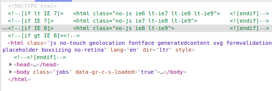
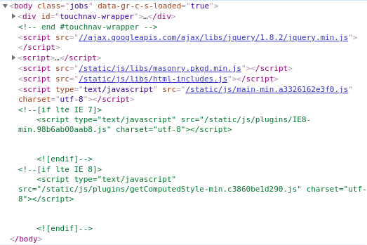
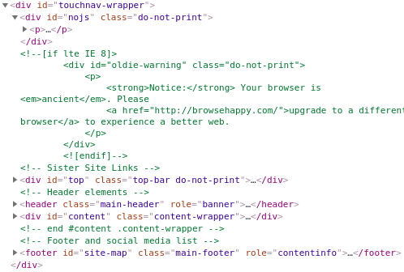
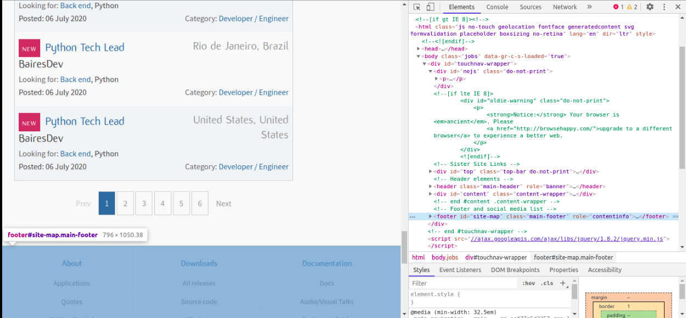
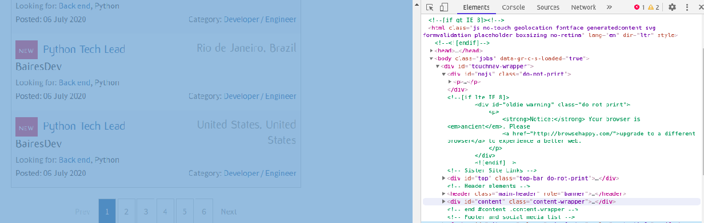
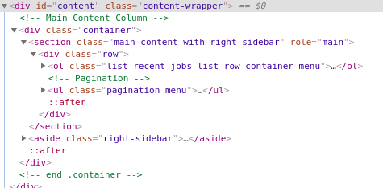
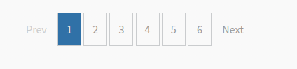
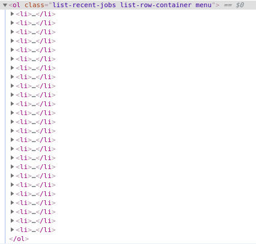
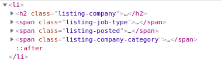
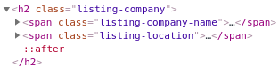

# Prikupiti oglase za posao **python.org/jobs**

Ova aplikacija prikazuje kako se na jednostavan način mogu prikupiti podaci sa neke web stranice.

U primjeru je korištena _python.org_ kao izvor podataka.

Svaka web stranice ima tri osnovne komponente (taga) **html**, **head**, **body**

Primjer osnovne strukture _.html_ dokumenta:

```
<html>
  <head>
    <title>This is the title of the webpage!</title>
  </head>
  <body>
    <p>This is an example paragraph. Anything in the <strong>body</strong> tag will appear on the page, just like this <strong>p</strong> tag and its contents.</p>
  </body>
</html>
```

Sadžaj strnice se uvijek nalazi unuar _body_ taga. Kako je organizovan sadržaj unutar _body_ taga zavisi od svake stranice zasebno. 

U ovom primjeru bit će pokazana organizacije _python.org/jobs_ stranice. Dijelovi koji su nepotrebni biti će izostavljeni.

Organizacija _python.org/jobs_ stranice:



Trenutno nas zanima samo sadržaj pa ćemo zanemariti ostalo.

Slika ispod pokazuje ogranizaciju **body** taga


u ovom slučju nas **scripts** tag ne zanima pa ćemo ga zanemariti. Pored **scripts**  taga na istom nivou nalazi se `<div id="touchnav-wraper>"`, pa ćemo zaviriti unutar njega da vidimo šta se nalazi.



Kao što se može vidjeti na slici iznad unutar ovog taga se nali sada nekoliko novih. Kada se dođe mišem na svaki od ovih tagova, dio stranice koji odgovara ovom tgagu biti će označen. Kao na primjer:



Na slici iznad smo došli mišem na footer i on nam je označen, međutim unutar footera se ne nalze informacije koje mi tražimo pa ga možemo ignorisati.

Nama je potreba sadržaj stranice pa ćemo doći preko taga koji ima `id="content"`.



Dolaskom pokazivačem miša iznad taga `<div id="content">` označen je dio dokumenta u kojem se nalazi sadržaj od interesa. 

U narednom koraku je potrebno pogledati šta se nalazi unutar `<div id="content">` taga.



Sada je već potrbno dobro obratiti pažnju na sadržaj ovog tga.

Prvo što je bitno prikupljanje traženih podataka jeste `<ol class="list-recent-jobs list-row-contaner menu">...</ol>` tag.

Unutar ovog taga nalazi se lista sa objavljenim oglasima za posao (u ovoj listi se nalaze svi traženi podaci).

I druga stvar koju je bitno odma spomenuti jeste
`<ul class="pagination menu"...</ul>`.
Unutar ovog taga nalaze se lista stranice (broj stranice u podnožju). Kao što je prikazano na slici ispd.



Budući da ima veliki broj oglasa i oni su podijeljeni u nekoliko stranica korištenjem linka za **Next** ići se na sljedeću stranicu.

Procedura je sljedeća:
1. Pokupiti podatke iz svih postavljenih oglasa.
2. Otići na link next kako bi se prešlo na sljedeću stranicu koja sadrži oglse

Ova pocedura se ponavlja sve dok se ne prođe kroz sve stranice.

## Lista sa oglasima

Sada kad se došlo do liste sa pojedinim oglasima potrebno je pogledati kako su prezentovani ti oglasi,



Sada kada se vidi kako doći do liste svih oglasa bit će prezentovan kod kako je dohvatiti.

## Uključivanje potrebnih modula

Za dohvatanje sadržaja neke stranice korišten je `requests`modul a za jednostavnije manipulisanje `html` dokumentom korišten je `bs4` modul. 

```python
import requests
from bs4 import BeautifulSoup
```

Za instalaciju ovih modula potrebno je izršiti komande:

1. `pip install requests`
2. `pip install bs4`

Nako što su moduli instalirani sve je spremno da zaljni rad.

```python
site = 'https://www.python.org/jobs/'
result = requests.get(site)
```

Prvo što je je urađeno jeste definisanje URL do stranice na kojoj se nalaze oglasi a korištenjem `requsts.get()`dohvata se sadržaj stranice.

```python
src = result.content
soup = BeautifulSoup(src, 'html.parser')
```

Nakon što se dohvati tražena stranica potrebno je uzeti njen izvodni kod korištenje `src = result.content` i iskoristiti `src`za kreiranje novog `BeautifulSoup` objekta. On će biti dalje korišten za manipulacije sadžajem html dokumenta.

```python
mainBodySection = soup.find('section')
# find orderd list containing all jobt advert
jobOrderList = mainBodySection.find('ol')
# find all list items (jobs) 
jobItemsList = jobOrderList.find_all('li')
```

Kod iznad pokazuje kako doći do liste oglasa. Kao što je slikama i prezentovano. Prvo se traži `section` tag a nakon toga `ol` tag kao što se može vidjeti na slici iznad.
Naša `ol` lista ima više elemenata potrebno je koristiti `find_all` metod. 

Sada se ima lista sa svim oglasima i potrebno je iterirati kroz listu i izvući tražene podatke iz svakog oglasa.

```python
for jobItem in jobItemsList:
  ...
```

Na slici ispod je prikazana organizacija unutar jednog oglasa.



Kao što se može vidjeti na slici oglas se stastoji od jednog `h2` i tri `span` taga.
Unutar ovih tagova se nalaze informacije koje su od interesa.

Prvo se kreće sa `h2` tagom. Njegov sadržaj se može dobiti izvšavanjem sljedeće linije koda:

```python
# company listing
companyListing = jobItem.find('h2')
```

Sadržaj `h2` taga je priazan na slici ispod:
